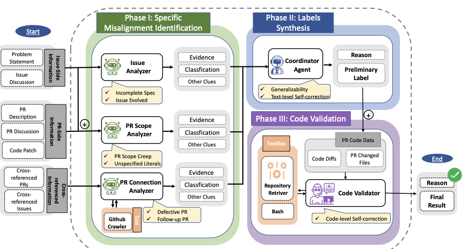

<div align="center">

<h1>PAIChecker</h1>

**发现并检测 SWE-Bench 类基准中的 PR-Issue 语义错位**

[English](README.md) | [简体中文](README.zh-CN.md)

[](https://doi.org/10.1145/3832783.3837557)
[](LICENSE)
[](https://www.python.org/)

</div>

PAIChecker 通过特定模式文本分析、跨智能体结果综合和代码级验证，检测并分类 GitHub issue 与其关联 pull request 之间的语义错位。

## 动态

- **2026-08** — 🔥 Codex 和 Claude Code Skill 正式发布！
- **2026-08** — 🔥 PAIChecker 及其标注数据集正式开源！
- **2026-07** — 🔥 PAIChecker 被 ASE 2026 录用！

## 如何使用

### 👉 Prompt Your LLM

选择 `binary` 检测是否存在语义错位，或选择 `types` 分类具体错位类型。

**方式一 — 使用 Skill（最快）**

```text
从 https://github.com/manyifire/PAIChecker 安装 PAIChecker Skill，然后使用 <binary|types> 模式分析 <PR>。如果提供了 <ISSUE>，将其作为目标 issue。只返回 JSON。
```

`<PR>` 支持 `owner/repo#123` 或 PR URL；`<ISSUE>` 支持 `owner/repo#45` 或 issue URL。未指定 issue 时，Skill 会查找并整体分析所有关联 issues；没有关联 issue 时返回 `no_linked_issue`。

**方式二 — 运行完整 PAIChecker**

```text
在隔离环境中从 https://github.com/manyifire/PAIChecker 克隆并安装完整 PAIChecker。使用 <MODEL>，以 <binary|types> 模式处理 <INPUT_JSONL>，将结果保存到 <OUTPUT_JSONL>，并报告运行状态。使用环境变量中已有的凭据；如果缺少凭据，告诉我需要设置哪些环境变量。
```

### 语义错位类型

PAIChecker 严格遵循论文定义的五类模式：

| 标签 | 模式 | 定义 |
| --- | --- | --- |
| `SC` | PR Scope Creep | PR 实现了原始 issue 未要求的额外功能。 |
| `DP` | Defective PR | 当前 PR 引入了新 bug 或仅提供不完整修复，因而需要后续纠正。 |
| `FP` | Follow-up PR | 当前 PR 是对同一 issue 的先前 PR 的补充或纠正。 |
| `IS` | Incomplete Specification | 原始 issue 在后续讨论中被补充或修改，且 PR 实现了这些后续需求。 |
| `UL` | Unspecified Literal | PR 引入了测试会精确断言的固定运行时 literal，但 issue 及其讨论从未规定该 literal。 |

`Others` 表示不属于上述五类的明确错位。`No Misalignment` 仅在没有受证据支持的错位时使用，且不能与其他标签共存。

### 手动配置

**Skill**

```bash
git clone --depth 1 https://github.com/manyifire/PAIChecker.git

# Codex
mkdir -p ~/.agents/skills
cp -R PAIChecker/.agents/skills/paichecker ~/.agents/skills/paichecker

# Claude Code
mkdir -p ~/.claude/skills
cp -R PAIChecker/.claude/skills/paichecker ~/.claude/skills/paichecker
```

Skill 是轻量替代方案，可直接获取证据并完成分析，无需运行 Python pipeline。

**完整 PAIChecker**

<div align="center">
  
</div>

需要 Python 3.13+，并支持 [LiteLLM](https://docs.litellm.ai/) 提供的任意模型。

```bash
git clone https://github.com/manyifire/PAIChecker.git
cd PAIChecker
python3.13 -m venv .venv
source .venv/bin/activate
python -m pip install -e .

export OPENAI_API_KEY="..."
export MSWEA_MODEL_NAME="openai/<model>"
export GITHUB_TOKEN="..."  # 可选；请使用只读 token。

python -m paichecker check \
  --input examples/dp_example.jsonl \
  --mode types \
  --output results.jsonl
```

该命令会处理 JSONL 文件中的所有记录。使用 `--mode binary` 进行二分类检测，使用 `--model` 覆盖默认模型。输入格式参见[示例](examples/dp_example.jsonl)和[文档](docs/input-format.md)。

| 模式 | JSON 结果 |
| --- | --- |
| `binary` | `status`、`pr`、`issues`、`misaligned` 和 `reason` |
| `types` | `status`、`pr`、`issues` 和具有证据支持的 `classifications` |

> [!WARNING]
> 完整 pipeline 会执行语言模型生成的 shell 命令。请仅在权限受限的隔离环境中运行，并且不要暴露具有写权限的凭据。

## 引用

如果 PAIChecker 对你的工作有帮助，请引用：

```bibtex
@article{wang2026paichecker,
  title={PAIChecker: Uncovering and Checking PR-Issue Misalignment in SWE-Bench-Like Benchmarks},
  author={Wang, Manyi and Xu, Junjielong and He, Pinjia},
  journal={arXiv preprint arXiv:2607.28587},
  year={2026}
}
```

## 致谢

PAIChecker 基于 [Mini-SWE-Agent](https://github.com/SWE-agent/mini-swe-agent) 构建。
